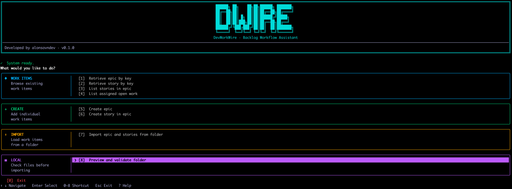

# DevWorkWire

Load an already-defined work structure (Epics, Stories, Acceptance Criteria) into your project tracker — validated, previewed, and duplicate-free.



> **Status:** alpha (`0.1.0`). Jira is the only supported provider.

## Features

- **Folder import** — load an `epic.md` and optional `stories.md` into Jira as one epic with linked stories.
- **Preview and validate first** — `preview-folder` checks the Markdown locally, with file and line locations for every error, before anything is written.
- **Safe to rerun** — a local resume record skips items already uploaded and stops on uncertain outcomes instead of creating duplicates.
- **Interactive menu or direct commands** — browse, create, preview, and import from a keyboard-driven menu, or script the same actions.
- **JSON output** — `--format json` returns one machine-readable result per command for scripts and AI agents.
- **AI agent skill** — a portable skill in [`skills/devworkwire/`](skills/devworkwire/SKILL.md) teaches terminal-capable agents to use the CLI.

## Requirements

- Python 3.12+
- A Jira account and an [API token](https://id.atlassian.com/manage-profile/security/api-tokens)

## Quick start

```bash
git clone https://github.com/alonsovndev/dev-work-wire.git
cd dev-work-wire
python -m venv .venv && source .venv/bin/activate
pip install -r requirements.txt

dwire config setup   # Jira URL, email, API token and your first project, stored for your user
dwire config add-project OTHER   # optional: more projects; pick one per run with --project

dwire
```

Running `dwire` with no command opens the interactive menu. See [Installation](docs/getting-started/installation.md) and [Configuration](docs/getting-started/configuration.md) for details.

## Usage

```bash
dwire fetch-epic PROJ-123
dwire list-stories PROJ-123
dwire list-assigned
dwire create-story PROJ-123 --title "Log in" --points 5

dwire preview-folder path/to/work-items
dwire import-folder path/to/work-items
dwire --format json import-folder path/to/work-items --yes
```

| Command | Purpose |
|---|---|
| `fetch-epic`, `fetch-story` | Show one epic or story |
| `list-stories`, `list-assigned` | List an epic's stories, or open work assigned to a user |
| `create-epic`, `create-story` | Create a single item |
| `preview-folder` | Validate a folder locally without contacting Jira |
| `import-folder` | Create the epic and stories from a folder |
| `resolve-import`, `rebind-import-story`, `retire-import-story` | Reconcile the local import record |

The [CLI Reference](docs/guides/cli-reference.md) covers every option, the JSON result format, and exit codes. The folder layout is described in the [Markdown Format](docs/guides/markdown-format.md) guide.

## Documentation

Full documentation is in [`docs/`](docs/README.md): installation, configuration, CLI reference, the AI agent skill, architecture, and testing.

## Development

```bash
pytest
```

See [Contributing](CONTRIBUTING.md) and the [Development Setup](docs/development/setup.md) guide.

## License

[MIT](LICENSE)
