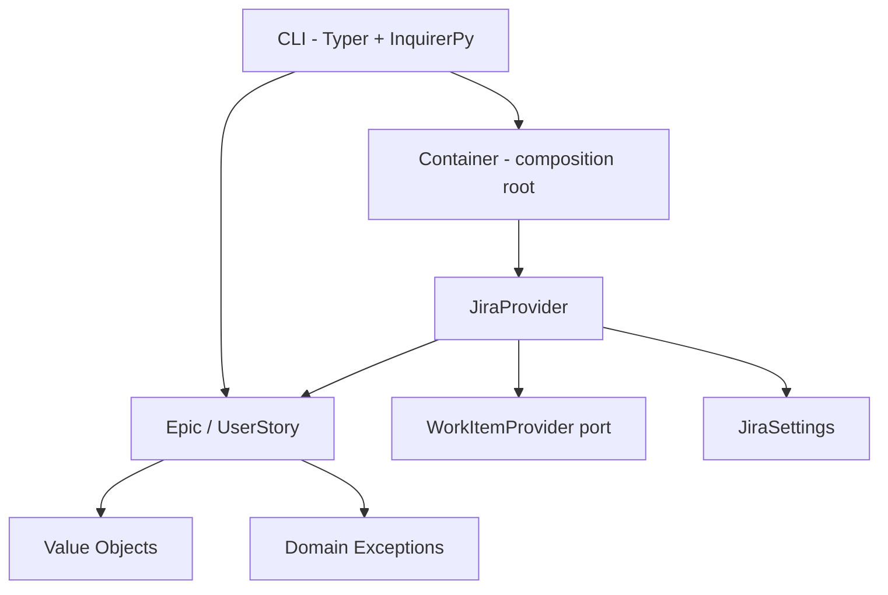
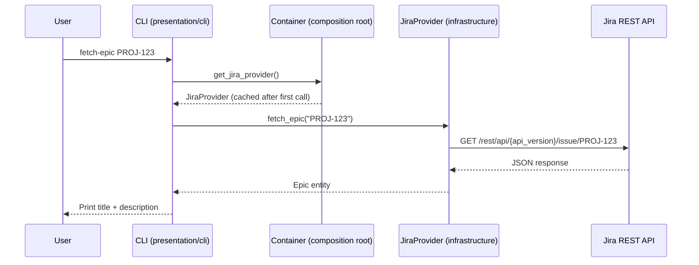

# Architecture Overview

DevWorkWire follows Clean Architecture with Ports & Adapters: domain rules stay
independent of external concerns (Jira, the CLI framework, logging), so the
system is testable and the Jira adapter is swappable.

> This project is on the `feature/devworkwire-baseline-reconstruction` branch,
> which reset a larger prior design (per-feature repositories, a SQLite import
> engine, an MCP server) back to a small, verified baseline. The structure
> below reflects what actually exists in `src/` today; see [Planned
> Work](#planned-work) for what the empty package scaffolding is reserved for.

## Current Structure

```
src/devworkwire/
├── config/                      # AppConfig singleton, ProjectConfig loader, environment YAML files
├── core/
│   ├── domain/                  # Epic, UserStory entities; IssueId/Priority/StoryPoints/Label value objects; domain exceptions
│   ├── ports/                   # WorkItemProvider ABC
│   ├── service/                 # (empty — reserved, see Planned Work)
│   └── composition.py           # Composition root: Container wires JiraProvider from config
├── features/
│   ├── import_/application/     # Epic/stories markdown parsers
│   ├── progress/                # (empty — reserved)
│   └── workitem/                # (empty — reserved)
├── infrastructure/
│   ├── external/jira/           # JiraProvider (WorkItemProvider impl) + JiraSettings
│   └── local/store/             # (empty — reserved)
├── presentation/
│   ├── cli/                     # Typer app: direct commands + interactive menu
│   └── mcp/                     # (empty — reserved)
└── shared/                      # Structured logging, retry decorator
```

**Dependency rules:**

1. `core/domain` has no framework, HTTP, or persistence dependency.
2. `infrastructure` implements the `WorkItemProvider` port defined in `core/ports`; nothing in `core` imports `infrastructure`.
3. `presentation/cli` depends on the composition root (`core/composition.py`) to obtain a configured provider — it never constructs `JiraProvider` directly.



## Request Flow



`import-folder <folder>` follows a similar shape: the CLI parses `<folder>/epic.md`,
calls `provider.create_epic()`, then parses `<folder>/stories.md` (skipped if
absent) and calls `provider.create_story(story, epic_key=...)` once per story,
linking each to the epic via Jira's `parent` field. A story failure is reported
and does not stop the remaining stories.

## Core Domain (`core/domain/`)

- **`entities.py`** — `Epic` and `UserStory`. Both validate their title in `__init__` (raising `BusinessRuleViolation` on an empty/blank title); `.create()` is a thin, documented entry point with the same validation, not a required gate — direct construction is also valid.
- **`value_objects.py`** — `IssueId`, `Priority`, `StoryPoints`, `Label`: frozen dataclasses, immutable, self-validating.
- **`exceptions.py`** — `DomainException` and its subclasses (`BusinessRuleViolation`, `NotFoundException`, `DuplicateException`, `InvalidTransitionException`).

## Jira Adapter (`infrastructure/external/jira/`)

- **`settings.py`** — `JiraSettings`: frozen dataclass holding `base_url`, `username`, `api_token`, `project_key`, `api_version`, `timeout`, `max_retries`. Built by the composition root from `AppConfig` + `ProjectConfig`.
- **`jira_provider.py`** — `JiraProvider(WorkItemProvider)`: implements epic and story creation/retrieval plus paginated story and assigned-work listing over `httpx`, with retries for transient failures. `create_story` links to its parent Epic via Jira's `parent` field and sends story points using the configured field mapping. The HTTP client honors `settings.timeout`; issue URLs honor `settings.api_version`.

## Configuration (`config/`)

1. **`AppConfig`** — singleton; loads `.env` via `python-dotenv`, then `config_{APP_ENV}.yml` (defaults to `local`). Exposes `get_config("jira.timeout", default=...)` with dot-notation access.
2. **`ProjectConfig`** — loads `devworkwire.yml` from the working directory: `provider`, `project_key`, `field_mappings`, `transition_overrides`. Raises `BusinessRuleViolation` on missing/unsupported values.

## Composition Root (`core/composition.py`)

`Container.get_jira_provider()` is the only place that builds a `JiraSettings` from config and constructs a `JiraProvider`; the result is cached on the instance. The CLI never imports `JiraProvider` or `JiraSettings` directly.

## Presentation (`presentation/cli/main.py`)

A Typer app with direct commands for individual epic/story creation and retrieval, story and assigned-work listing, and folder import, plus an interactive, keyboard-navigable menu (built with `InquirerPy`) shown when `dwire` is invoked with no subcommand. Both paths call the same async action helpers. `import-folder` expects `epic.md` (required) and `stories.md` (optional) — see [Markdown Format Specification](../guides/markdown-format.md).

## Planned Work

These packages exist as empty scaffolding for work that hasn't landed yet on this branch — treat them as reserved namespaces, not partially-built features:

| Package | Reserved for |
|---|---|
| `features/progress/` | Tracking import/creation progress across a batch of work items |
| `features/workitem/` | A generic work-item abstraction above Epic/UserStory |
| `infrastructure/local/store/` | Local state persistence (a prior iteration used SQLite; not yet rebuilt) |
| `presentation/mcp/` | An MCP server exposing DevWorkWire operations as tools |
| `core/service/` | Cross-feature application services, once more than one feature needs to share orchestration |
